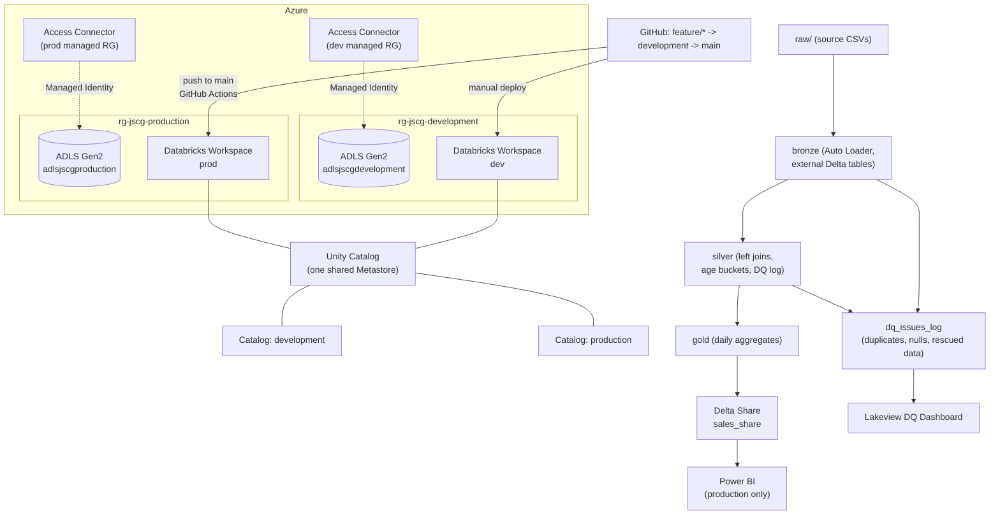

# dtbr-cicd

# E-commerce Sales — Medallion ETL on Databricks

End-to-end data platform built on Azure Databricks: raw e-commerce data is ingested,
cleaned, and aggregated through a Bronze → Silver → Gold medallion architecture,
governed by Unity Catalog, deployed through a Databricks Asset Bundle, and promoted
across environments via GitHub Actions. Gold-layer data is published to Power BI
through Delta Sharing, and a Databricks (Lakeview) dashboard tracks data-quality
issues detected during ingestion and transformation.

## Architecture



## Hard constraints from the brief

- **Managed Identity only** for the raw-layer connection — no service principal, no Key
  Vault. Enforced via an Access Connector per workspace, used as the identity behind
  every Unity Catalog Storage Credential.
- **No DBFS, no Volume as the raw layer** — raw files live in plain ADLS Gen2
  containers, accessed through Unity Catalog External Locations.
- **PySpark, not Spark SQL** for the ETL logic — every transformation (extract, join,
  filter, aggregate) uses the DataFrame API. `spark.sql(...)` is used only for DDL
  (`CREATE CATALOG`, `CREATE TABLE`, `GRANT`), which has no DataFrame equivalent.
- **Four raw datasets** — `ecommerce_sales`, `customer_master`,
  `order_items`, `product_catalog` are joined in Silver.
- **CI/CD via GitHub Actions**, deploying dev → prod through a Databricks Asset
  Bundle.

## Environments

| | Development | Production |
|---|---|---|
| Resource group | `rg-jscg-development` | `rg-jscg-production` |
| Storage account | `adlsjscgdevelopment` | `adlsjscgproduction` |
| Databricks workspace | `dtbr-jscg-development` | `dtbr-jscg-production` |
| Unity Catalog | `development` | `production` |
| Deploy trigger | Manual (`databricks bundle deploy -t dev`) | Automatic (push to `main`) |

Both workspaces share **one Unity Catalog Metastore**, created explicitly for this
project rather than relying on the Azure-provisioned default. A single Access
Connector per workspace (auto-provisioned in each workspace's managed resource
group) backs that workspace's Storage Credential — no manual service principal
ever created.

**Feature branches** (`feature/<name>`) deploy to the same `dev` target and write
directly into the `development` catalog — there is no per-feature catalog or
storage isolation. This trades isolation for simplicity: every write is an
idempotent `MERGE`, so re-running a feature branch's pipeline is always safe.

## Storage layout

Each storage account has six containers: `raw`, `bronze`, `silver`, `gold`,
`metastore`, `checkpoints` (for Auto Loader state). One Unity
Catalog External Location covers each container. The catalog's own managed
storage lives in its own subfolder of `metastore/` (`metastore/development/`,
`metastore/production/`) — never the container root, since Unity Catalog does
not allow two catalogs' managed storage to overlap.

Every table in Bronze, Silver and Gold is an **external** Delta table, created
with an explicit `LOCATION` inside its layer's container — not a managed table.

## The pipeline

1. **`00_envPrep.sql`** — idempotent (`IF NOT EXISTS` throughout): creates the
   Storage Credential-backed External Locations, the catalog, its three schemas,
   and the `dq_issues_log` tables.
2. **`01_ingest*.py`** (×4) — Auto Loader (`cloudFiles`), incremental, with
   checkpointing. Each run:
   - reads new raw files against an explicit schema,
   - checks for duplicate keys, null keys, and rescued (malformed) data, logging
     any issues found to `dq_issues_log`,
   - `MERGE`s the cleaned batch into its Bronze table.
3. **`02_transformSales.py`** — left-joins sales, customers, order items and
   products (so an unmatched row is logged, not silently dropped), adds an age
   bucket, `MERGE`s into Silver.
4. **`03_loadSales.py`** — aggregates completed orders by date, channel, segment,
   product category, etc.; full `overwrite` into Gold (cheap to fully recompute,
   no natural single-row key to `MERGE` on).
5. **`04_grants.sql`** — `data-analysts` (read-only across all layers) and
   `data-engineers` (read/write bronze+silver+gold, plus file-level grants on
   the relevant External Locations).
6. **`05_deltaShare.sql`** — production only: creates the share, adds the Gold
   table, grants the Power BI recipient.

## Data quality

A single `dq_issues_log` table per schema (bronze, silver) captures three kinds
of issue, uniformly:

| check_type | Meaning |
|---|---|
| `duplicate` | More than one row shares the same key in a batch |
| `null_key` | A row's key column is null |
| `rescued_data` / `unmatched_join` | A row didn't parse cleanly (Bronze) / didn't find its join partner (Silver) |

A Lakeview dashboard (`dashboard/dq_dashboard.json`) visualizes this log by date
and by check type, and is deployed as a bundle resource alongside the pipeline.

## Delta Sharing → Power BI

Power BI connects **only to production's Gold table**, never to development.
`CREATE SHARE`/`CREATE RECIPIENT`/`GRANT` run exclusively in the `prod` target's
job — nothing in development is ever shared externally.

## CI/CD — Databricks Asset Bundle + GitHub Actions

- The bundle (`ecommerce_sales_dev/`) defines two jobs (`ecommerce_sales_pipeline`,
  `ecommerce_sales_delta_share`) and one dashboard resource, parameterized per
  target via bundle variables (`storageName`, `credentialName`,
  `externalLocationName`, `catalog`, `warehouse_id`).
- Every task carries explicit `base_parameters` rather than relying on each
  notebook's own widget defaults — Databricks can share a session across
  sequential tasks in one job run, and a widget's `dbutils.widgets.text(...)`
  default is silently ignored if that widget already has a value from an earlier
  task. Explicit parameters make every task self-contained.
- **Dev**: deployed by hand (`databricks bundle deploy -t dev`), run by hand.
  `mode: development` prefixes the job name (`[dev <user>] ...`) and pauses any
  schedule.
- **Prod**: `.github/workflows/deploy.yml` triggers on push to `main`, rewrites
  the dashboard's catalog reference from `development` to `production` in the
  Action's checked-out copy only, then runs `databricks bundle deploy -t prod`
  followed by `databricks bundle run -t prod ecommerce_sales_pipeline`.
- Compute is **serverless** throughout — including the Auto Loader
  (`foreachBatch`/`writeStream`) ingest tasks, which run reliably inside a job's
  own session even though the same pattern can be unstable in a long-lived
  interactive notebook session.

> **Note on folder naming:** the brief's structure table names this folder
> `.github/workflow/` (singular). GitHub Actions only ever scans
> `.github/workflows/` (plural) — a file at the singular path is never
> triggered, with no error. This repo uses the functional, plural path so the
> pipeline actually runs; see `evidencias/` for the working Action.

## Repository structure

```text
.
├── datasets/              raw source files
├── dashboard/             Lakeview JSON+PNG, Power BI PBIX+PNG, Delta Share link
├── reversion/             reversion.sql
├── .github/
│   └── workflows/
│       └── deploy.yml     dev -> prod CI/CD
├── seguridad/
│   └── 04_grants.sql
├── prepAmb/
│   └── 00_envPrep.sql
├── proceso/
│   └── ecommerce_sales_dev/   the Databricks Asset Bundle
│       ├── databricks.yml
│       ├── resources/
│       │   ├── ecommerce_sales_pipeline.job.yml
│       │   ├── ecommerce_sales_delta_share.job.yml
│       │   └── dq_dashboard.dashboard.yml
│       └── src/                9 notebooks + dq_dashboard.lvdash.json
├── certificaciones/
├── evidencias/
└── readme.md
```

## Author

Built by Joan Cruz as the final project for the Databricks course.
